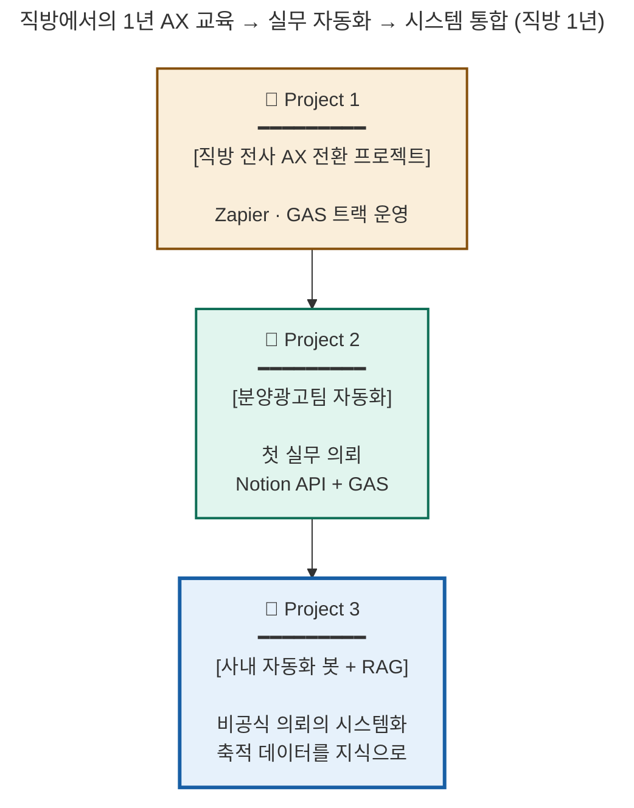

# 정소희 포트폴리오

> 
> 
> 1. **직방 Internal Product 팀에서 비개발 동료를 위한 자동화·AI 도구 구현**
> 2. **"고객사 문제를 교육 솔루션으로 설계 + 컨설턴트 시각 보유" - 친절한 기술 번역가 (직방 사내 AX교육 기획·운영한 Internal Product Engineer/Operator )**
> 3. **사내 제품을 오너십을 가지고 기획부터 구현까지 - 직방 사내 자동화 요청 앱 구축**

## 프로젝트 요약

| 프로젝트 | 핵심 성과 | 매칭 키워드 |
| --- | --- | --- |
| **Project 1 — 직방 전사 AX 전환** | 비개발 직군 4단계 AX 로드맵 + 수료율 82% | 교육 솔루션 설계 · 컨설턴트 시각 |
| **Project 2 — 분양광고팀 거래처 데이터 자동화** | Notion API + GAS · 휴먼 에러 0% · 10초 | AI/노코드/SaaS 자동화 |
| **Project 3 — 사내 자동화 봇 + RAG 통합** | AWS Lambda + Claude API · 마무리 단계 | 데이터 자산화 · 시스템 통합 |

[Zigbang AX 프로젝트](%EC%A0%95%EC%86%8C%ED%9D%AC%20%ED%8F%AC%ED%8A%B8%ED%8F%B4%EB%A6%AC%EC%98%A4/Zigbang%20AX%20%ED%94%84%EB%A1%9C%EC%A0%9D%ED%8A%B8%200fe2c25672f9831f86f80188d9dc402c.csv)

---

## Skills & Tools

> 🤖 **AI · 자동화** → ☁️ **클라우드** → 💻 **프로그래밍** → 📊 **데이터 · 운영**
직방 1년 실무로 다뤄온 4개 영역
> 

| 카테고리 | 도구·기술 | 숙련도 | 활용 사례 |
| --- | --- | --- | --- |
| **🤖 AI · 자동화** | Claude API · RAG 시스템 | 직접 구현 | [Project 3] 자동화 봇 + RAG |
|  | Notion API · Google Apps Script | 실무 자동화 | [Project 2] 분양광고팀 자동화 |
|  | Slack API · Block Kit | 직접 구현 | [Project 3] 인터랙티브 봇 |
|  | Zapier | 강의·운영 | [Project 1] AX 교육 트랙 |
| **☁️ 클라우드** | AWS Lambda · DynamoDB · API Gateway · IAM | 실무 경험 | [Project 3] 봇 인프라 |
| **💻 프로그래밍** | JavaScript | 상급 | AWS Lambda 운영·자동화 봇 |
|  | Python | 학습 중 | — |
|  | Swift | 중급 | iOS 앱 출시 2개 |
| **📊 데이터 · 운영** | ADsP (데이터 분석 준전문가) | 2023 자격 | — |
|  | ITSM 운영 | 실무 경험 | SaaS·IT 장비·계정·티켓·정책 문서화 |
|  | Git / GitHub | 상급 | [github.com/heexohee](https://github.com/heexohee) |