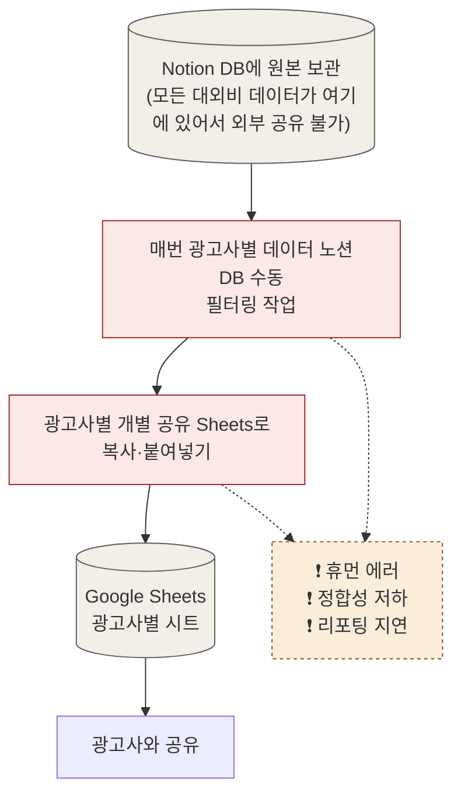
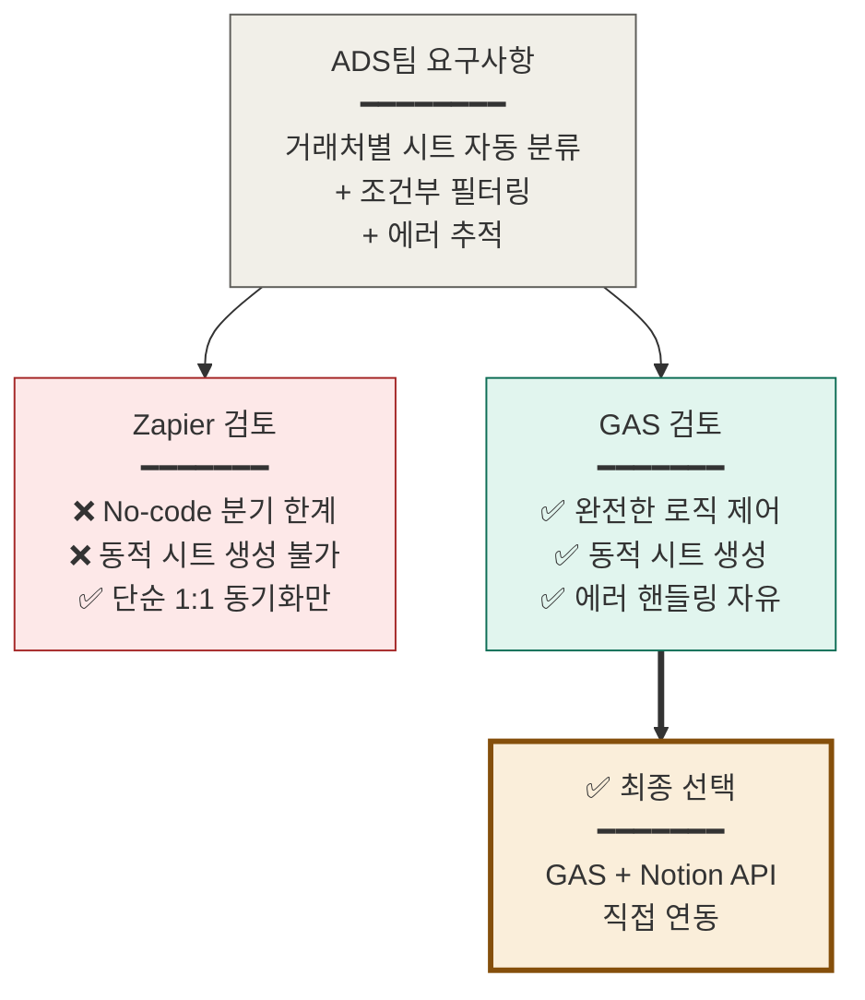
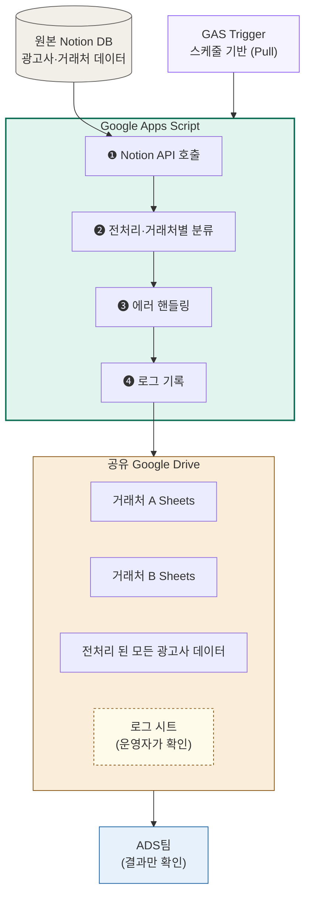
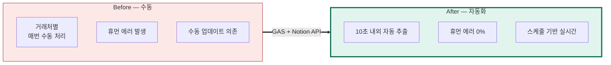

# 프로젝트2. 분양광고팀 거래처별 데이터 추출 자동화

생성일: 2026년 5월 30일 오후 2:53

- 기간 : 2026.02 - 2026.07

# ADS팀(분양광고팀) 거래처별 데이터 추출 자동화

> 비개발 직군과의 직접 협업을 통해, Notion DB의 광고사·거래처 데이터를 거래처별로 자동 분류·추출하는 Google Apps Script 기반 파이프라인을 설계·구현한 프로젝트.
> 

---

## 1. 요약

> ADS팀이 사내 내부 노션 DB에서 관리하는 광고사·거래처 데이터를, 거래처별 현황 공유를 위해 **매번 수동 조건 필터링 후, 복사·붙여넣기로 광고사별 시트에 옮기던 작업**을 자동화. 

**결과 : Notion API + GAS 파이프라인**으로 거래처별 자동 분류·동기화를 구현해 휴먼 에러 0%, 추출 시간 10초 내외를 달성했습니다.
> 

| 영역 | 내용 |
| --- | --- |
| **역할** | 인터뷰 · 파이프라인 설계 · 구현 · 운영 이관 |
| **협업 대상** | ADS팀 (분양광고팀 - 비개발 직군) |
| **기술 스택** | Notion API · Google Apps Script · Google Sheets |
| **성과** | 휴먼 에러 0% · 추출 10초 내외 · 실시간 동기화 |

---

## 2. 문제 정의

### 2-1. Before — 수동 워크플로우

### 2-2. 식별된 문제 3가지

| 문제 | 결과 |
| --- | --- |
| **휴먼에러(비효율적 수동 작업)** | 필터링·복사·분류에 매번 상당한 운영 리소스 소요 |
| **데이터 정합성 이슈** | 수동 이관 과정의 휴먼 에러로 광고 집행 지표 신뢰도 저하 |
| **리포팅 지연** | 거래처별 맞춤 데이터 추출에 시간이 걸려 실시간 최적화 불가 |

### 2-3. 인터뷰로 드러난 진짜 문제

> ADS팀의 첫 요청은 *"노션 데이터를 시트로 자동으로 옮겨주세요"* 였습니다. 인터뷰를 진행하면서 실제 페인포인트는 다른 곳에 있다는 것을 발견했습니다.
> 

| 표면 요청 | 진짜 문제 |
| --- | --- |
| *"데이터를 자동으로 옮겨주세요"* | *"거래처별 분류와 정합성 유지가 매번 부담"* |

→ 표면 요청만 들어줬다면 단순 동기화 스크립트로 끝났을 것. 진짜 문제를 찾았기에 *거래처별 자동 분류 + 에러 핸들링 + 로그 시스템* 까지 설계했습니다.

---

## 3. 기술적 의사결정

### 3-1. 도구 선택 — 왜 Zapier가 아닌 GAS인가

- 기존에 AX사내 교육 프로젝트에서 배운 Zapier로는 해결할 수 없는 영역.

| 채택 여부 | 옵션 | 장점 | 단점 |
| --- | --- | --- | --- |
| ❌ | Zapier + Notion Integration | No-code, 빠른 셋업 | 복잡한 분기 어려움, 거래처별 시트 자동 생성 한계 |
| ✅ | **GAS + Notion API 직접 호출** | **완전한 로직 제어, 거래처별 자동 분류 가능** | 코드 작성 필요 |

→ ADS팀의 *"거래처별 시트로 자동 분류"* 라는 요구는 Zapier의 No-code 분기로는 해결할 수 없는 영역. GAS 채택의 명확한 근거.

### 3-2. 스케줄링 전략 — Pull vs Push

**선택:** 
정해진 스케줄(GAS Trigger)로 동기화하는 **Pull 방식**.

**이유:**

- Notion API의 Webhook 안정성·제한 고려
- GAS Trigger의 신뢰성과 디버깅 용이성
- ADS팀이 "실시간" 보다 "**정확한 최신**" 을 더 중요시함 (분 단위 지연 허용)

### 3-3. 에러 핸들링 — 로그를 시트에 함께 기록

> API 호출 실패·데이터 누락을 방지하기 위한 방어 로직 추가. 
더 중요한 결정은 **로그를 시트에 함께 기록한 것**이었습니다.
> 

| 일반적 접근 | 채택한 접근 |
| --- | --- |
| 로그를 GAS Logger.log에 기록 | **로그 시트를 별도로 만들어 ADS팀이 직접 확인 가능** |

**→ ADS팀(비개발 직군)이 "왜 안 됐는지"를 스스로 확인할 수 있게 만든 결정. 지속 가능,인계 가능한 시스템.**

---

## 4. 시스템 아키텍처

---

## 5. 결과 (After)

### 5-1. 정량 성과

| 지표 | Before | After |
| --- | --- | --- |
| 추출 소요 시간 | 거래처별 수동 처리 | **10초 내외** |
| 휴먼 에러 | 수동 작업으로 종종 발생 | **0%** |
| 최신 데이터 반영 | 수동 업데이트 시점 의존 | **실시간 (스케줄 기반)** |
| ADS팀 운영 리소스 | 반복 작업에 시간 소진 | **광고 전략 분석 등 고부가가치 업무로 전환** |

### 5-2. 정성 성과

- **데이터 신뢰도 회복:** 광고 집행 의사결정의 근거 지표 정합성 확보
- **ADS팀의 자생적 활용:** ADS팀이 직접 GAS 코드 일부를 수정·확장할 수 있도록 주석·문서화 (시트 기반 운영 가이드 포함)

---

## 6. 비개발 직군 협업에서 체득한 원칙

### 6-1. 표면 요청 ≠ 진짜 문제

> 
> 
> 
> 비개발 직군은 자신의 워크플로우를 기술적 해결을 위한 개발언어로 번역해 본 경험이 적기 때문에, "이런 자동화가 가능하다"는 개발 지식+소통 능력을 가진 사람이 인터뷰로 끌어내야 했습니다. 
> 

### 6-2. "인계 가능한" 시스템 만들기

비개발 직군과의 협업에서 가장 중요한 건 "내가 떠나도 이 시스템이 살아남는가" 입니다.

- **주석을 코드 옆이 아닌 시트에:** ADS팀이 GAS 코드보다 시트가 익숙하므로 운영 가이드를 시트에 작성
- **에러 메시지를 사람의 언어로:** *"401 Unauthorized"* 가 아니라 *"노션 연결 토큰이 만료되었어요. [재설정 가이드 링크]"*
- **수정 가능한 영역 명시:** "이 셀의 값만 바꿔도 거래처 추가 가능" 같은 명확한 경계

### 6-3. 자동화 시스템이 살아남는 건 정교한 코드가 아니라 

“운영자가 이해할 수 있는 쉽고 직관적인 인터페이스”

→ 이후 사내 자동화 봇 설계 시 모달의 가독성, 에러 메시지의 인간 언어화, DB 필드의 자기 설명력 같은 모든 결정의 기준이 되었습니다.

---

> 💡 이 프로젝트와 같은 자동화 의뢰가 사내에서 누적되며, 비공식 채널의 한계가 드러났습니다. 이 문제 인식이 다음 프로젝트인 [**[사내 자동화 봇 + RAG 시스템]**](%ED%94%84%EB%A1%9C%EC%A0%9D%ED%8A%B83%20%EC%A7%81%EB%B0%A9%20%EC%82%AC%EB%82%B4%20%EC%9E%90%EB%8F%99%ED%99%94%20%EC%9A%94%EC%B2%AD%20%EB%B4%87%20+%20RAG%20%EC%A7%80%EC%8B%9D%20%EB%B4%87%20%EA%B0%9C%EB%B0%9C%20%EB%B0%8F%20%ED%86%B5%ED%95%A9%20%EC%8B%9C%EC%8A%A4%ED%85%9C%2025a2c25672f9821caaa181cfdc107643.md) 으로 이어졌습니다.
>