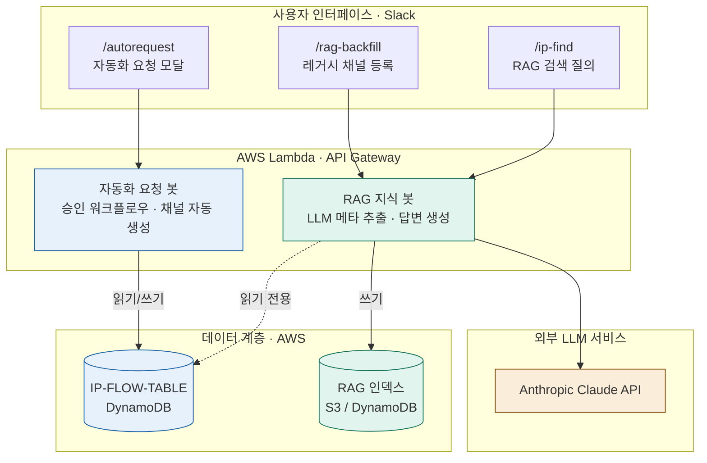
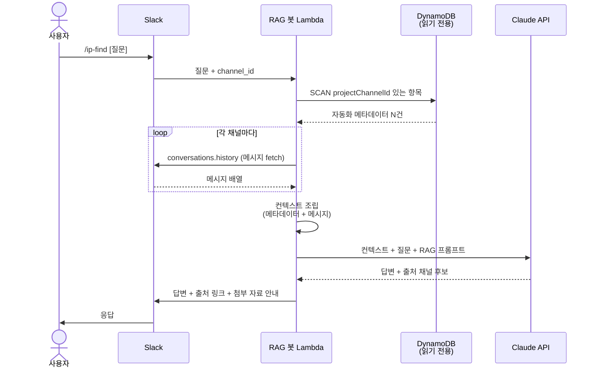
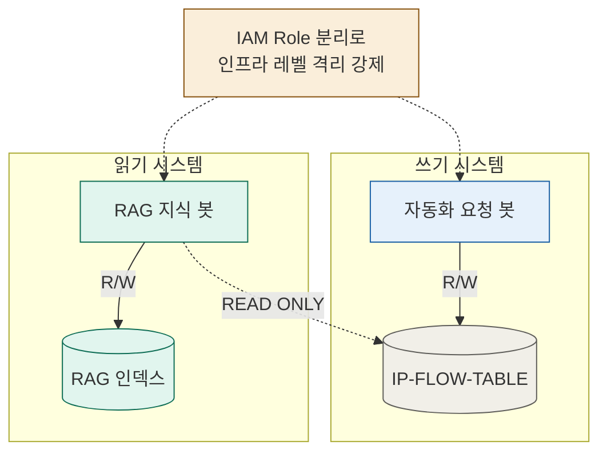

# 프로젝트3. 직방 사내 자동화 요청 봇 + RAG 지식 봇 개발 및 통합 시스템

생성일: 2026년 5월 30일 오후 2:53

- 기간 : 2026.03 - 2026.04

# 직방 사내 자동화 요청 봇 + RAG 지식 봇 개발 및 통합 시스템

> **비정형 자동화 요청을 표준화된 워크플로우로 전환하고, 축적된 협업 데이터를 LLM 기반 검색 시스템으로 자산화하는 사내 봇 두 개를 통합 설계 및 구현했습니다.**
> 


---

## 1. 요약

> 
> 
> 
> **직방 사내 Slack에 "자동화 요청을 받는 봇"**과 **"자동화 지식을 답해주는 봇"**을 같은 데이터 인프라 위에 설계하여, 운영 시스템과 신규 AI 기능이 독립적으로 진화할 수 있는 구조와 사내 거버넌스를 구축했습니다.
> 

| 시스템 | 역할 | 상태 |
| --- | --- | --- |
| **자동화 요청 봇** 
(Zigbang Automation Bot) | 요청·승인·채널 생성 운영 파이프라인 | 실 운영 중 |
| **RAG 지식 봇** 
(Zigbang Knowledge Bot) | 축적된 협업 데이터 기반 사내 지식 검색 | 설계 완료·구현 진행 중 |

---

## 2. 기존 **문제 진단 :**

1. 자동화 요청 거버넌스 부재
    - 부서장 승인 없이 실무자에게 직접 요청이 가고 있어, 팀-팀원 간 우선순위 조율이 불가능했음.
2. 히스토리 휘발성
    - DM으로 처리된 요청은 검색되지 않고, 담당자가 바뀌면 그대로 사라졌습니다.
3. 데이터 자산화의 실패:
    - "어떤 업무가 자동화되어야 하는가" 라는 가장 중요한 질문에 답할 데이터가 없었음.

---

## 3. 통합 아키텍처

### 3-1. 시스템 다이어그램



### 3-2. 데이터 흐름 — 시퀀스

#### **Flow A. 자동화 요청 봇 (1차-2차 승인 프로세스)**



```
사용자 → /autorequest → 모달 입력 → DynamoDB PUT
       → 1차 승인자(부서장) DM → 승인 클릭
       → IP팀 채널로 2차 승인 요청 → 승인 클릭
       → Slack 채널 자동 생성 + 관계자 초대
       → DynamoDB UPDATE (projectChannelId 기록) ★
       → 환영 메시지 전송
```

#### **Flow B. RAG 지식 봇 (검색)**


```
사용자 → /ip-find [질문]
       → Lambda가 IP-FLOW-TABLE 스캔 (projectChannelId 있는 항목만)
       → 각 채널의 메시지를 Slack API로 fetch
       → 컨텍스트 + 질문을 Claude에 전송
       → 답변 + 출처 채널 링크 + 첨부 자료 링크를 Slack에 응답
```

#### **Flow C. RAG 지식 봇 (레거시 백필 - LLM 보조 메타데이터 추출)**


```
관리자 → 레거시 협업 채널에서 /rag-backfill
       → Lambda가 채널 메시지 fetch
       → Claude에게 "메타데이터를 JSON으로 추출해줘" 프롬프트
       → 추출된 결과를 사용자 검증 모달로 표시
       → 사용자가 검토/수정/승인
       → DynamoDB PUT (source: "rag-backfill-llm")
```

---

## 4. 설계 결정과 트레이드오프

### 4-1. CQRS — 읽기/쓰기 분리



**결정:**

> **RAG 봇은 IP-FLOW-TABLE에 읽기 전용으로만 접근하고, 자기 결과는 별도의 데이터 저장소(또는 다른 항목 네임스페이스)에 기록.**
> 

**이유:**

- 운영 중인 자동화 요청 시스템의 신뢰성 보장
- 신규 봇의 버그·실패가 핵심 운영 흐름에 전염되지 않도록 격리
- IAM 권한 분리로 인프라 레벨에서 강제

**대안과 비교:**

| 옵션 | 장점 | 단점 | 채택 |
| --- | --- | --- | --- |
| 단일 테이블 공유 (R/W) | 단순함 | 운영 시스템 영향 위험 | ❌ |
| **별도 테이블 + 읽기 전용 참조** | **운영 격리, IAM 강제 가능** | **약간의 설계 비용** | **✔️** |
| 완전 분리 (DynamoDB 복제) | 최고 격리 | 동기화 비용 과다 | ❌ |

### 4-2. 결정론(Deterministic) vs 확률론(Probabilistic) 영역 분리

**결정:** 같은 시스템 안에서 코드로 처리할 영역과 LLM이 판단할 영역을 명확히 구분.

```mermaid
flowchart LR
    subgraph Det["결정론 영역 (코드)"]
        direction TB
        d1["부서장 승인 매핑"]
        d2["DynamoDB 트랜잭션"]
        d3["Slack 채널 생성·초대"]
        d4["권한 체크 · IAM"]
    end

    subgraph Prob["확률론 영역 (LLM)"]
        direction TB
        p1["요청 카테고리 분류"]
        p2["메시지 메타 추출"]
        p3["검색 답변 생성"]
        p4["요약 · 의미 매칭"]
    end

    subgraph Bridge["연결 지점"]
        direction TB
        b1["Human-in-the-Loop<br/>검증 모달"]
        b2["JSON 스키마 강제"]
        b3["근거 출처 첨부"]
    end

    Det <--> Bridge
    Bridge <--> Prob

    style Det fill:#E6F1FB,stroke:#185FA5
    style Prob fill:#FAEEDA,stroke:#854F0B
    style Bridge fill:#E1F5EE,stroke:#0F6E56
```



| 작업 | 처리 방식 | 이유 |
| --- | --- | --- |
| 부서장 승인 매핑 | **코드 (결정론)** | 권한·거버넌스는 흔들리면 안 됨 |
| DynamoDB 트랜잭션 | **코드 (결정론)** | 데이터 무결성 |
| Slack 채널 생성·초대 | **코드 (결정론)** | API 호출 결과의 일관성 |
| 자동화 요청 카테고리 분류 | **LLM (확률론)** | 자연어 의미 이해 필요 |
| 채널 메시지에서 메타데이터 추출 | **LLM (확률론)** | 비정형 텍스트 해석 |
| 검색 질문에 대한 답변 생성 | **LLM (확률론)** | 컨텍스트 종합 |

**핵심:** 좋은 AI 시스템은 "LLM을 어디에 쓸 것인가" 보다 "어디에 쓰지 않을 것인가" 를 정확히 판단하는 데서 출발함.

### 4-3. Human-in-the-Loop — LLM 출력은 사람이 승인 후 저장

**결정:** LLM이 추출한 메타데이터는 DB에 즉시 저장하지 않고, **반드시 운영자의 검증 모달을 거친 후 저장**.

**이유:**

- LLM의 환각·오추출 위험 완화
- "바이브 코딩의 한계": LLM은 초안을 만들고, 최종적으로 사람이 결정한다.
- 검증 과정에서 사용자가 잘못된 추출을 수정 → 시스템 신뢰도 점진적 향상

### 4-4. 점진적 메타데이터 보강 (Progressive Enrichment)


**결정:** 등록 시점에 사용자가 입력하지 않은 필드는 LLM이 자동 추출하거나, 나중에 비동기로 보강.

**예시:**

- 사용자가 모달에서 입력: 제목, 팀
- LLM이 자동 추출: 카테고리, 한 줄 요약, 사용 도구 추정
- 시간 경과 후 자동 계산: 리드타임, 메시지 수, 활성도

### 4-5. 멱등성과 방어적 에러 처리

**결정:** 신규 기능 추가가 기존 운영 흐름을 막지 않도록 중첩 try-catch 구조 적용.

```jsx
try {
    // 핵심: 채널 생성 + 초대 (성공해야 함)
    const createRes = await slack.conversations.create({...});
    await slack.conversations.invite({...});

    // 부가: 채널 정보 DB 기록 — 실패해도 사용자 흐름은 막지 않음
    try {
        await docClient.send(new UpdateCommand({...}));
    } catch (dbError) {
        console.error("[WARN] 채널 ID DB 기록 실패 (운영 영향 없음)", dbError);
    }

    // 핵심: 환영 메시지 전송
    await slack.chat.postMessage({...});
} catch (channelError) {
    console.error("[ERROR] 채널 생성/초대 실패", channelError);
}
```

**원칙:** "채널 ID 기록은 부가 기능, 채널 생성·초대·환영 메시지는 핵심 기능" 이라는 우선순위를 코드 구조로 표현.

---

## 5. 트러블슈팅 기록

- **Issue 1. 협업 채널 ID가 DynamoDB에 저장되지 않고 있었음**
    
    **증상:**
    초기 자동화 요청 봇의 `approve_2nd` 분기에서 Slack 채널을 생성한 후, 채널 ID(`createRes.channel.id`)를 변수로만 사용하고 DB에는 기록하지 않고 있었음. 채널은 슬랙에 존재하지만, 시스템이 *"어떤 요청이 어떤 채널로 갔는지"* 추적할 수 없는 상태.
    
    **영향:**
    
    - 향후 RAG 봇이 채널 메시지를 인덱싱할 때 *어떤 채널을 읽어야 할지* 알 방법이 없음
    - 운영 관점에서 **요청 → 채널 → 해결** 의 전체 흐름이 단절됨
    
    **해결:**`approve_2nd` 분기에 DynamoDB `UpdateCommand`를 추가하여 채널 ID·채널명·생성 시각을 함께 기록.
    
    ```jsx
    await docClient.send(new UpdateCommand({
        TableName: "IP-FLOW-TABLE",
        Key: { requestId: requestId },
        UpdateExpression: "set projectChannelId = :cid, projectChannelName = :cname, channelCreatedAt = :cat",
        ExpressionAttributeValues: {
            ":cid": newChannelId,
            ":cname": channelName,
            ":cat": new Date().toISOString()
        }
    }));
    ```
    
    **배운 점:** "미래의 기능을 위해 지금부터 데이터를 쌓아두는 사고" 의 중요성. 현재 봇만 동작하면 되는 게 아니라, 향후 그 데이터를 누가 어떻게 쓸 것인가 를 미리 설계해야 한다.
    
- **Issue 2. DynamoDB는 스키마리스 — 코드 배포만으로 속성이 추가되지 않음**
    
    **증상:**
    `approve_2nd`에 `projectChannelId` 저장 코드를 추가했지만, 이미 DynamoDB에 존재하는 기존 항목들에는 해당 속성이 자동으로 추가되지 않음.
    
    **원인:**
    DynamoDB는 RDB와 달리 *스키마리스(Schemaless)* 구조. 컬럼 정의가 따로 없고, `UpdateCommand`가 실행되는 *순간 그 항목에만* 속성이 동적으로 추가됨.
    
    **해결:**
    
    - 신규 요청: 코드 배포 이후 자동 기록 (해결됨)
    - 기존 요청 (운영 중인 자동화 협업 채널 3건): **수동 백필** + **`/rag-backfill` LLM 자동 추출 도구** 병행
    
    **배운 점:**
    RDB와 NoSQL의 차이를 *이론*이 아니라 *운영 상황*에서 체득. *"새로운 컬럼 추가하면 끝"* 이 아니라 *"기존 데이터를 어떻게 채울 것인가"* 가 더 중요한 문제.
    
- **Issue 3. 비공식 DM 요청으로 시작된 협업 채널 — 메타데이터 자체가 없음**
    
    **증상:**
    기존에 운영 중인 자동화 협업 채널 중 일부는 *정식 요청 봇*을 거치지 않고 **DM으로 직접 요청** 받아 시작된 건이라, DynamoDB에 해당 요청에 대한 항목 자체가 존재하지 않음. 채널만 슬랙에 떠 있는 상태.
    
    **문제의 본질:**
    RAG 봇이 검색·답변하려면 *"이 채널은 어떤 자동화 건인가"* 라는 메타데이터가 필요한데, 수기로 옛 기억을 더듬어 채워넣는 건 비효율적이고 정확도도 낮음.
    
    **해결책 (설계):**`/rag-backfill` 슬래시 커맨드를 신규 RAG Lambda에 구현. 흐름:
    
    1. 사용자가 레거시 협업 채널 안에서 `/rag-backfill` 입력
    2. Lambda가 해당 채널의 최근 메시지 100개를 `conversations.history` API로 fetch
    3. Claude API에 *"이 메시지들을 보고 자동화 요청의 메타데이터(제목, 팀, 문제점, 기대효과, 카테고리)를 JSON으로 추출해줘"* 요청
    4. 추출된 결과를 사용자 검증 모달로 표시 (초기값으로 미리 채움)
    5. 사용자가 검토·수정·승인 후 DynamoDB에 PUT
    
    **설계 포인트:**
    
    - 단순 "수동 입력" 대신 "LLM 보조 + 사람 검증" 의 협업 패턴
    - 같은 패턴이 미래의 신규 레거시 케이스에서도 재사용 가능
    - 공고의 "RAG 챗봇, AI Agent 등 LLM 기반 기능을 직접 구현" 요건의 핵심 사례
    
    **배운 점:**
    "데이터가 없으면 만들어 넣는다" 는 단순한 해결책 대신, "데이터를 LLM이 채울 수 있는 시스템을 만든다" 는 한 단계 위의 해결책이 가능함을 확인.
    
- **Issue 4. 운영 중인 자동화 봇을 수정하지 않고 신규 RAG 봇을 만들 방법**
    
    
    **증상:**
    RAG 봇이 동작하려면 "어떤 채널이 자동화 협업 채널인지" 를 알아야 하지만, 운영 중인 자동화 봇 코드를 대규모로 수정하는 건 리스크가 큼.
    
    **해결책 (설계):**
    운영 봇과 RAG 봇을 **물리적으로 분리된 Lambda 함수**로 두고, 공유 데이터(IP-FLOW-TABLE)는 읽기 전용으로만 참조, RAG 봇의 결과는 별도 저장소에 기록. 운영 봇 코드는 최소 수정(채널 ID 저장 한 줄 추가)만 적용.
    
    **아키텍처 원칙:**
    
    > "부가 기능 때문에 핵심 운영이 망가지지 않는 것" 을 시스템 설계의 첫 번째 원칙으로 삼는다.
    > 
    
    **IAM 권한 분리 예시:**
    
    ```
    [운영 봇 Lambda Role]
    - IP-FLOW-TABLE: PutItem, UpdateItem, GetItem, Query
    
    [RAG 봇 Lambda Role]
    - IP-FLOW-TABLE: GetItem, Query, Scan (읽기 전용)
    - RAG 자체 저장소: 전체 권한
    ```
    
    코드에 버그가 있어 실수로 IP-FLOW-TABLE을 수정하려고 해도 IAM이 차단. 코드 레벨이 아닌 인프라 레벨의 격리.
    
- **Issue 5. Google Workspace / 외부 도구 링크 처리 범위**
    
    
    **증상:**
    협업 채널의 메시지에는 Google Drive·Sheets·Notion·GitHub 등 외부 도구의 링크가 자주 공유됨. RAG 봇이 답변할 때 이 자료들을 어디까지 인덱싱할 것인지 결정 필요.
    
    **의사결정:**
    
    | 옵션 | MVP 적합성 | 답변 품질 | 구현 복잡도 |
    | --- | --- | --- | --- |
    | 슬랙 메시지만 인덱싱 + 링크는 안내만 | ✓ | 중 | 낮음 |
    | 외부 문서 본문까지 fetch + 인덱싱 | ✗ | 높음 | 높음 (OAuth 권한·재인덱싱 전략 필요) |
    
    **결정:** 
    
    **MVP는 "슬랙 메시지 + 외부 링크 카탈로그" 로 제한. 외부 문서 통합은 향후 확장 단계로 분리.**
    
    **설계 사상:**
    
    > "모든 외부 문서를 한 번에 인덱싱하는 완벽주의는 MVP의 적이다. 무엇을 안 할지 정하는 것도 시스템 설계의 일부다."
    > 

---

## 6. 기술 스택

### 6-1. 자동화 요청 봇 (운영 중)

| 영역 | 기술 |
| --- | --- |
| 인터페이스 | Slack Block Kit (Interactive Modals) |
| 로직 | AWS Lambda (Node.js, ESM) |
| 데이터 | Amazon DynamoDB (NoSQL) |
| API | Slack Web API |
| 인프라 | API Gateway, IAM, CloudWatch Logs |

### 6-2. RAG 지식 봇 (구현 진행 중)

| 영역 | 기술 |
| --- | --- |
| 인터페이스 | Slack Slash Commands, Block Kit Modals |
| 로직 | AWS Lambda (Node.js) |
| 데이터 (참조) | DynamoDB IP-FLOW-TABLE (읽기 전용) |
| 데이터 (자체) | DynamoDB 별도 항목 / S3 |
| LLM | Anthropic Claude API |
| 메시지 소스 | Slack `conversations.history` API |
| (확장) 벡터 DB | OpenSearch Serverless / pgvector 후보 |

### 6-3. 의도적으로 현재 단계에서 채택하지 않은 것

| 미채택 기술 | 이유 |
| --- | --- |
| 임베딩 기반 벡터 검색 | 초기 데이터 규모(채널 3건)에서 Claude 컨텍스트 윈도우로 충분. 운영 단계에서 데이터 증가 시 점진 도입. |
| LangChain / LangGraph | RAG MVP 수준에서는 직접 구현이 더 명확하고 의존성이 가벼움. Agent 단계 진입 시 도입 검토. |
| OAuth 기반 외부 문서 통합 | 권한 모델·재인덱싱 전략 확정 후 단계적 확장 예정. |

---

## 7. 성과와 학습

### 7-1. 정량적 성과

**자동화 요청 봇 (운영 중):**

- 실제 운영된 자동화 협업 채널: 3건 (본인 진행 1건 + 팀원 진행 2건)
- 비정형 요청(이메일·DM)을 표준화된 워크플로우로 흡수하는 인프라 확보
- 1차 승인(부서장) → 2차 검토(IP팀) → 채널 자동 생성의 전 과정 자동화

> 운영 기간이 길지 않아 절대 건수는 적지만, 건수 자체보다 비정형 요청을 정형화하는 거버넌스 인프라를 확립한 것이 핵심 가치.
> 

### 7-2. 정성적 학습

- **NoSQL의 스키마리스 특성**을 운영 상황에서 체득 [(Issue 2)](%ED%94%84%EB%A1%9C%EC%A0%9D%ED%8A%B83%20%EC%A7%81%EB%B0%A9%20%EC%82%AC%EB%82%B4%20%EC%9E%90%EB%8F%99%ED%99%94%20%EC%9A%94%EC%B2%AD%20%EB%B4%87%20+%20RAG%20%EC%A7%80%EC%8B%9D%20%EB%B4%87%20%EA%B0%9C%EB%B0%9C%20%EB%B0%8F%20%ED%86%B5%ED%95%A9%20%EC%8B%9C%EC%8A%A4%ED%85%9C%2025a2c25672f9821caaa181cfdc107643.md)
- **운영 시스템을 건드리지 않고 부가 기능을 확장하는 설계 사고** [(Issue 4)](%ED%94%84%EB%A1%9C%EC%A0%9D%ED%8A%B83%20%EC%A7%81%EB%B0%A9%20%EC%82%AC%EB%82%B4%20%EC%9E%90%EB%8F%99%ED%99%94%20%EC%9A%94%EC%B2%AD%20%EB%B4%87%20+%20RAG%20%EC%A7%80%EC%8B%9D%20%EB%B4%87%20%EA%B0%9C%EB%B0%9C%20%EB%B0%8F%20%ED%86%B5%ED%95%A9%20%EC%8B%9C%EC%8A%A4%ED%85%9C%2025a2c25672f9821caaa181cfdc107643.md)
- **LLM의 한계를 시스템 구조로 보완하는 패턴** — Human-in-the-Loop, 결정론/확률론 분리 [(Issue 3](%ED%94%84%EB%A1%9C%EC%A0%9D%ED%8A%B83%20%EC%A7%81%EB%B0%A9%20%EC%82%AC%EB%82%B4%20%EC%9E%90%EB%8F%99%ED%99%94%20%EC%9A%94%EC%B2%AD%20%EB%B4%87%20+%20RAG%20%EC%A7%80%EC%8B%9D%20%EB%B4%87%20%EA%B0%9C%EB%B0%9C%20%EB%B0%8F%20%ED%86%B5%ED%95%A9%20%EC%8B%9C%EC%8A%A4%ED%85%9C%2025a2c25672f9821caaa181cfdc107643.md), [Section 3-2](%ED%94%84%EB%A1%9C%EC%A0%9D%ED%8A%B83%20%EC%A7%81%EB%B0%A9%20%EC%82%AC%EB%82%B4%20%EC%9E%90%EB%8F%99%ED%99%94%20%EC%9A%94%EC%B2%AD%20%EB%B4%87%20+%20RAG%20%EC%A7%80%EC%8B%9D%20%EB%B4%87%20%EA%B0%9C%EB%B0%9C%20%EB%B0%8F%20%ED%86%B5%ED%95%A9%20%EC%8B%9C%EC%8A%A4%ED%85%9C%2025a2c25672f9821caaa181cfdc107643.md))
- **"무엇을 안 할지 정하는 것"이 MVP의 핵심** [(Issue 5)](%ED%94%84%EB%A1%9C%EC%A0%9D%ED%8A%B83%20%EC%A7%81%EB%B0%A9%20%EC%82%AC%EB%82%B4%20%EC%9E%90%EB%8F%99%ED%99%94%20%EC%9A%94%EC%B2%AD%20%EB%B4%87%20+%20RAG%20%EC%A7%80%EC%8B%9D%20%EB%B4%87%20%EA%B0%9C%EB%B0%9C%20%EB%B0%8F%20%ED%86%B5%ED%95%A9%20%EC%8B%9C%EC%8A%A4%ED%85%9C%2025a2c25672f9821caaa181cfdc107643.md)

---

## 8. 향후 확장 계획

```
[Phase 1] MVP (현재)
  └─ RAG 봇 단순 검색 (Claude 컨텍스트 윈도우 직접 사용)
     /ip-find 명령어로 채널 메시지 종합 답변

[Phase 2] 임베딩 기반 검색
  └─ 메시지 단위 임베딩 + 벡터 검색
     OpenSearch Serverless 또는 pgvector 도입
     검색 정확도·속도 향상

[Phase 3] 외부 도구 통합
  └─ Google Workspace, Notion, GitHub 본문 인덱싱
     OAuth 기반 권한 인지 검색

[Phase 4] Agent 진화
  └─ "이 자동화 건 해결책 추천해줘" 같은 의사결정형 질의
     적합 도구(Zapier/GAS/Lambda) 추천 + 예상 공수 산정
     LangGraph 기반 다단계 추론
```